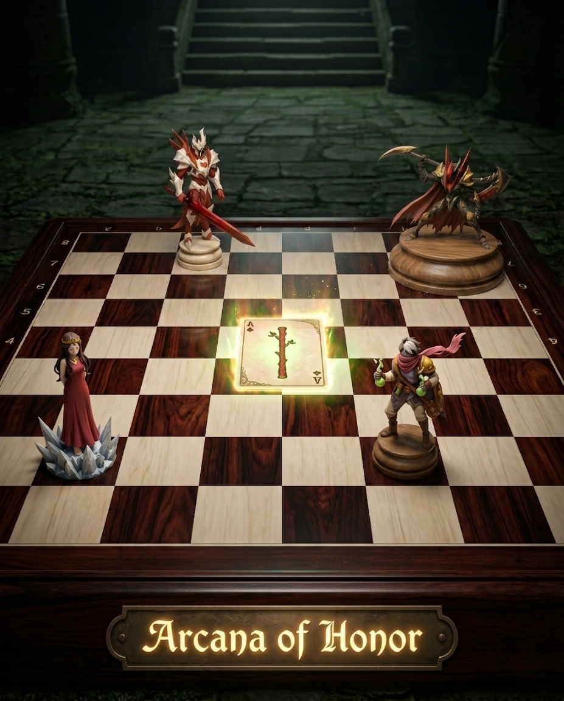
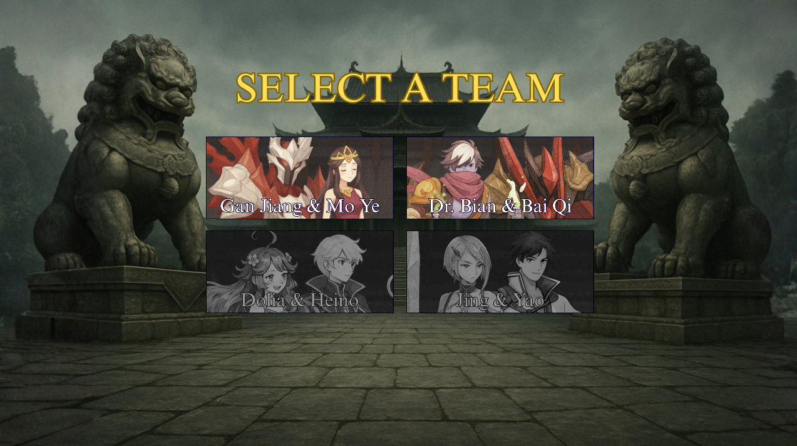
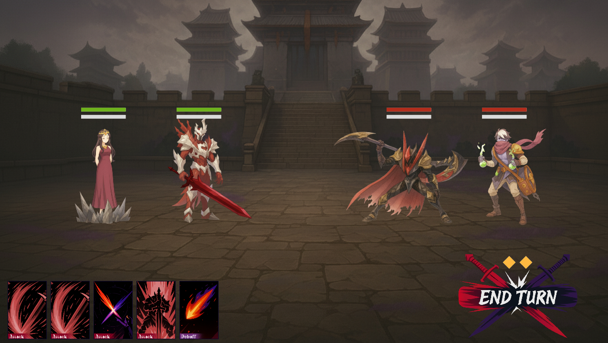
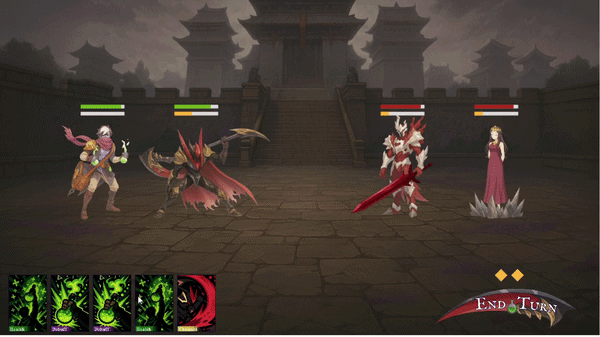
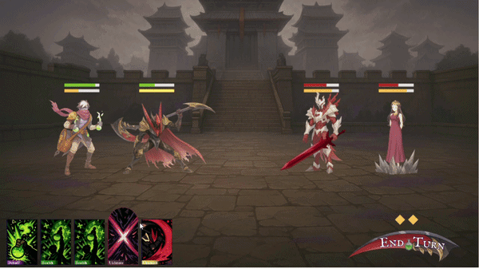

# Arcana of Honor

**Arcana of Honor** is a turn-based, card-battler strategy game developed in Greenfoot. It combines the tactical, card-based combat inspired by *Reverse: 1999* with the iconic roster of characters from *Honor of Kings*.

Choose a team of two legendary heroes, build a hand of their unique skills, and outmaneuver your opponent in a strategic 2v2 battle. Manage your Action Points, build towards devastating Ultimates, and master a variety of status effects to claim victory.

---

## Gameplay Previews

**Team Selection**

**Battle Screen**

**Using Skills**
 

**Ultimate Abilities**
 

---

## Features

-   **Tactical Turn-Based Combat:** Engage in strategic 2v2 battles where every decision matters.
-   **Dynamic Skilldock:** Your hand of 5 skill cards is randomly drawn from your heroes' abilities. Using a card consumes it, and your hand is replenished at the start of your next turn.
-   **Action Point (AP) System:** You have a limited number of Action Points per turn (one for each living ally), forcing you to make calculated choices.
-   **Ultimate Skills:** Using basic skills charges your heroes' Ultimate bars. Once full, their powerful Ultimate card is guaranteed to appear in your hand, ready to turn the tide of battle.
-   **Status Effects:** Master a variety of effects, from damage-over-time **[Poison]** to powerful buffs like **[Execution Stance]**.
-   **Animated Skills:** Every skill and ultimate is brought to life with unique character and effect animations.

---

## Available Teams

-   **[Gan Jiang & Mo Ye]**
    -   A high-risk, high-reward team focused on single-target burst damage and control.
-   **[Dr. Bian & Bai Qi]**
    -   A durable team specializing in sustainability, damage-over-time, and powerful stance-based combat.

---

## How to Play

1.  Download the latest release from the [Releases](https://github.com/YOUR_USERNAME/ArcanaOfHonor/releases) page.
2.  Unzip the folder.
3.  Run **`ArcanaOfHonor.exe`**.

The executable is a standalone application for Windows and should run without needing a separate Java or Greenfoot installation.

---

## Credits & Disclaimer

This is a non-commercial fan project created for educational and entertainment purposes only.

-   The gameplay mechanics are heavily inspired by **Reverse: 1999** by Bluepoch.
-   The characters, names, and likenesses are the property of TiMi Studio Group and are from the game **Honor of Kings**.

Please support the official releases of these fantastic games.
